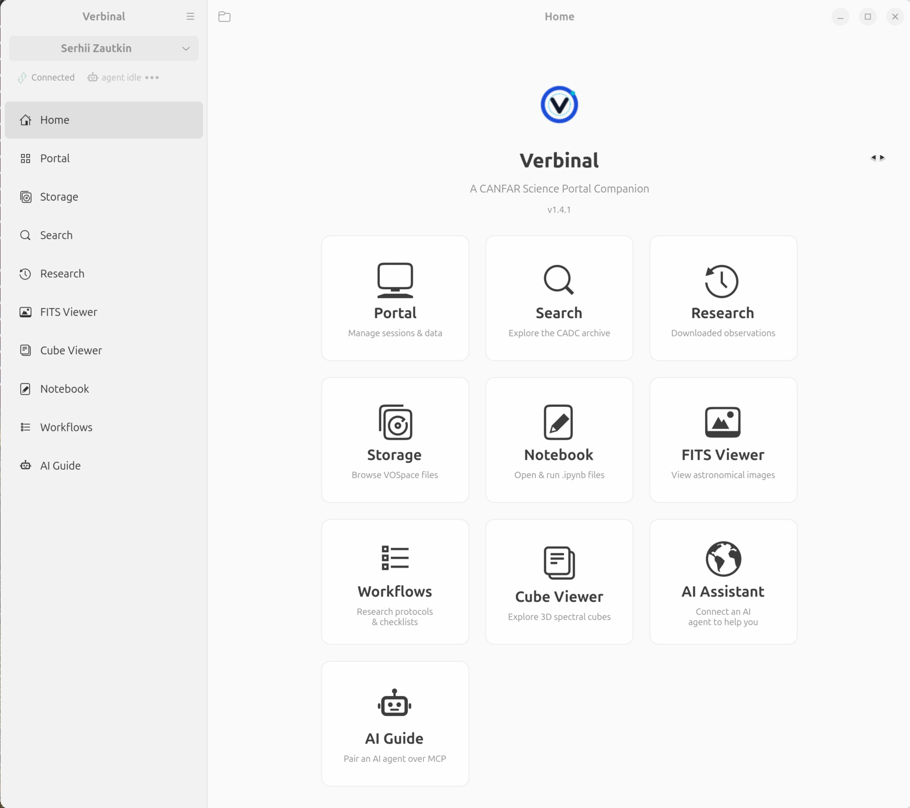
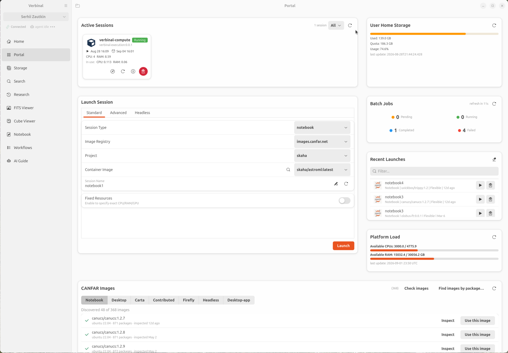
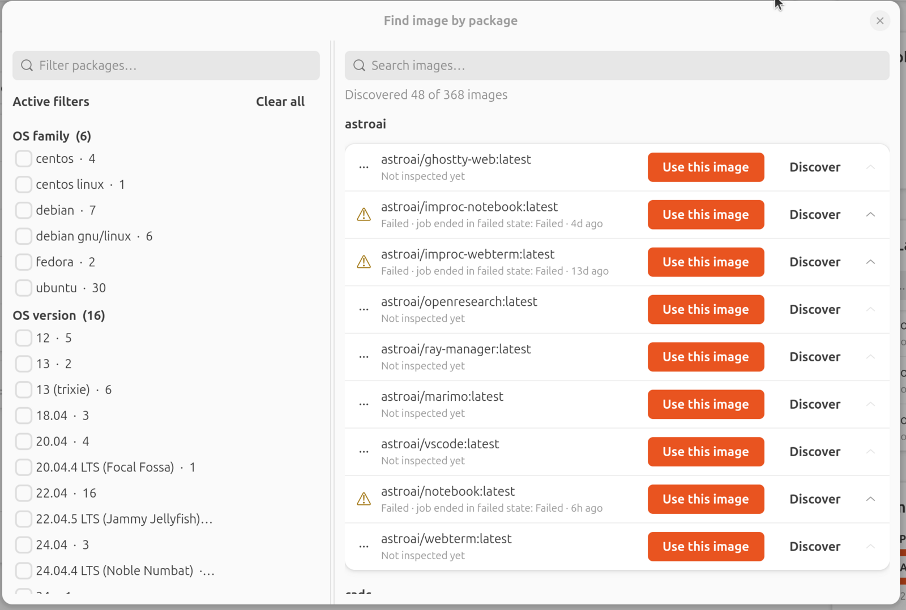
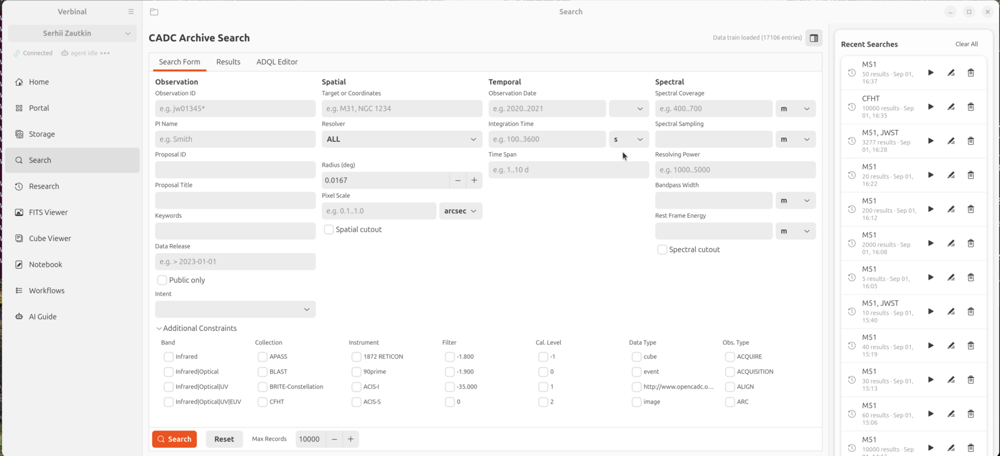
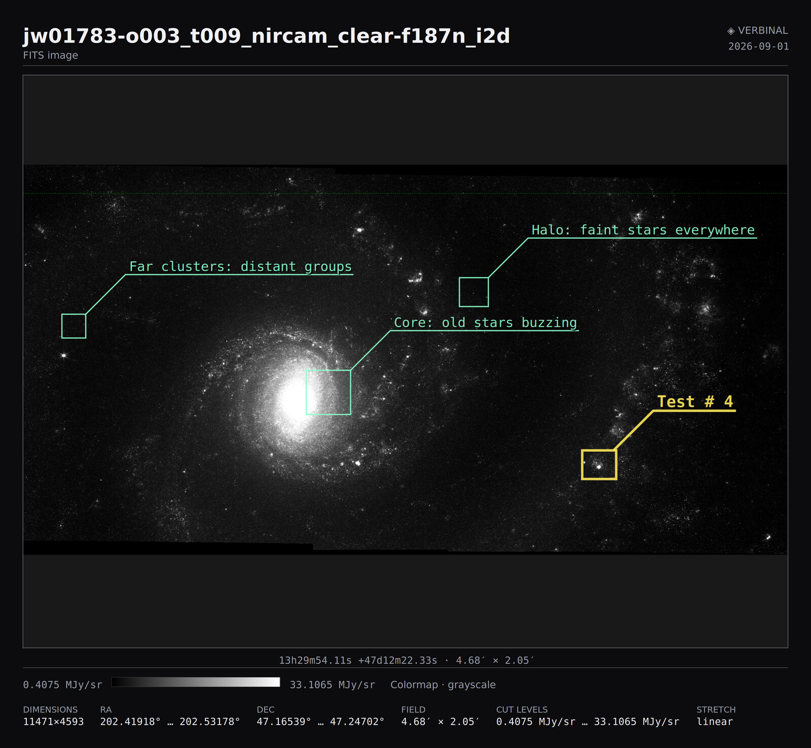

# Verbinal for Linux

A native Linux desktop companion for the [CANFAR Science Portal](https://www.canfar.net/), built with Rust, GTK 4, and libadwaita.

[](https://github.com/szautkin/CanfarDesktopUbuntu/actions/workflows/ci.yml)
[](https://github.com/szautkin/CanfarDesktopUbuntu/actions/workflows/release.yml)
[](LICENSE)

Project page, guides and downloads for every platform: **[verbinal.com](https://verbinal.com)**.

This is the Linux member of the Verbinal family.

## The same app on other platforms

Verbinal is one application per platform, each written natively for it, sharing
the behaviour rather than the code. Where they differ, this repository is the
one that leads.

| Platform | Source | Install |
| --- | --- | --- |
| **Linux** (this repo) | [CanfarDesktopUbuntu](https://github.com/szautkin/CanfarDesktopUbuntu) — Rust · GTK 4 · libadwaita | [Latest `.deb`](https://github.com/szautkin/CanfarDesktopUbuntu/releases/latest) |
| **Windows** | [CanfarDesktop](https://github.com/szautkin/CanfarDesktop) — C# · WinUI 3 | [Microsoft Store](https://apps.microsoft.com/detail/9p8jqvk4pjch) |
| **macOS** | [canfar-macos](https://github.com/szautkin/canfar-macos) — Swift · SwiftUI | — |
| **iOS / iPadOS** | — | [App Store](https://apps.apple.com/app/verbinal/id6761290036) |
| **Android** | [canfar-android](https://github.com/szautkin/canfar-android) — Kotlin | [Play (testing)](https://play.google.com/apps/testing/net.canfar.verbinal) |

The service all of them talk to is the CANFAR Science Portal
([opencadc/science-portal](https://github.com/opencadc/science-portal)), operated
by the [Canadian Astronomy Data Centre](https://www.cadc-ccda.hia-iha.nrc-cnrc.gc.ca/).

## Related projects

These open-source companions are what two of Verbinal's features actually run on
the platform:

- **[verbinal-execution](https://github.com/szautkin/verbinal-execution)** — a
  CANFAR/Skaha contributed-session image that powers Verbinal's AI **remote compute**
  (`run_code`). It is a file-drop watcher that runs agent-supplied Python/bash snippets
  and writes JSON results back — no shell, no inbound network. Run it in a contributed
  session to let your AI assistant execute code on the platform on your behalf.
- **[inspector-image](https://github.com/szautkin/inspector-image)** — a minimal
  Alpine container image with [Anchore syft](https://github.com/anchore/syft) preinstalled,
  used as the Skaha/CANFAR inspector that powers Verbinal's **image content discovery**
  (probing container images for their Python, R, system, and OS-level packages) — the
  "Find image by package" dialog above.

## Features

- **Session Management** - Launch, monitor, renew, and delete CANFAR science sessions (Notebook, Desktop, CARTA, Contributed, Firefly, Headless)
- **Storage Quota** - View VOSpace home directory usage at a glance
- **Platform Load** - Real-time cluster CPU, GPU, and RAM utilisation
- **Recent Launches** - Quick re-launch from session history
- **Standard & Advanced Launch** - Pick from the CANFAR image catalogue or supply a custom registry image with auth credentials
- **Auto-Refresh** - Active sessions poll automatically while any session is pending
- **Secure Credentials** - Tokens stored in the system keyring via Secret Service (GNOME Keyring / KDE Wallet)
- **FITS Viewer** - Multi-tab image viewer with WCS, colormaps and stretches, an extension selector, a crosshair with sky coordinates, saved coordinates, and blink / linked-crosshair / synced-zoom comparison across tabs
- **Cube Viewer** - GPU ray-marched 3D volume rendering with an opacity transfer function, plus a 2D slice view with a channel scrubber and per-voxel spectra
- **Marks** - Draw circles and boxes on an image or a cube, label them, move and resize them; they persist with the file and appear in exported figures
- **Archive Search** - CADC observation search with faceting, an ADQL editor, and previews
- **Notebooks** - Open and run Jupyter notebooks, with rendered cell output
- **AI Agent Access** - 160+ MCP tools over a local socket, so an assistant can drive the app, read what is on screen, point at things in it, and hand back a figure

## Screenshots

<p align="center">
  
</p>

**Portal** — active sessions, launch form, storage quota, batch jobs, platform load
and the CANFAR image catalogue on one page.

<p align="center">
  
</p>

**Find an image by package** — search 368 container images by what is installed in
them, faceted by OS family and version.

<p align="center">
  
</p>

**Archive search** — the CADC observation search: four constraint columns, the
faceted data train, an ADQL editor, and a recent-searches rail.

<p align="center">
  
</p>

**Export a figure** — what the FITS viewer hands back: the marks you drew with
their labels, the region's real sky coordinates, the cut levels and a colorbar.

<p align="center">
  
</p>

## Requirements

### Runtime
- GTK 4.12+
- libadwaita 1.4+
- A Secret Service provider (GNOME Keyring, KDE Wallet, or similar)
- A CANFAR account

### Build
- Rust 1.75+ (2021 edition)
- System development packages:
  ```
  # Debian / Ubuntu
  sudo apt install libgtk-4-dev libadwaita-1-dev libcfitsio-dev pkg-config

  # Fedora
  sudo dnf install gtk4-devel libadwaita-devel cfitsio-devel

  # Arch
  sudo pacman -S gtk4 libadwaita cfitsio
  ```

  cfitsio backs the FITS and cube viewers and the post-download shape check. It
  is required by default; `cargo build --no-default-features` builds without it,
  at the cost of not being able to open any FITS file.

## Building

```bash
# Debug build
cargo build

# Release build
cargo build --release

# Run
cargo run --release
```

The release binary will be at `target/release/verbinal`.

## Installing from .deb

Download the latest `.deb` from [Releases](https://github.com/szautkin/CanfarDesktopUbuntu/releases), then:

```bash
sudo dpkg -i verbinal_*_amd64.deb
sudo apt-get install -f  # install any missing dependencies
```

Or build the `.deb` yourself:

```bash
cargo install cargo-deb
cargo build --release
cargo deb --no-build
```

## Running Tests

```bash
cargo test
```

## Code Quality

```bash
# Lint — the exact command CI runs, so a green local run means a green CI run.
# `--all-targets` includes the tests. `dead_code` is NOT suppressed: an unused
# function is usually a feature that was written and never wired up, which is
# how several shipped defects here stayed invisible.
rustup update stable   # CI runs the latest stable; an older local clippy sees fewer lints
cargo clippy --all-targets -- -D warnings

# Format check
cargo fmt -- --check

# Format (apply)
cargo fmt
```

## Project Structure

```
src/
  main.rs              # Application entry point
  config.rs            # API endpoints and app configuration
  state.rs             # Shared application state (AppServices)
  style.css            # GTK CSS theme overrides
  helpers/             # Utility functions (image parsing)
  models/              # Data structures (Session, Image, etc.)
  services/            # API clients and business logic
  ui/                  # GTK widget components
assets/                # Session type icons
```

## Architecture

- **GTK 4 + libadwaita** for the UI layer
- **Tokio** multi-threaded runtime for async HTTP, bridged to GTK's GLib main loop via `oneshot` channels
- **Reqwest** with Rustls for HTTPS API calls
- **Rc/RefCell** ownership model for GTK widgets; `Arc` for cross-thread shared state
- Clean separation: Models -> Services -> UI

## API Endpoints

All communication is with CANFAR services over HTTPS. No telemetry, analytics, or third-party calls.

| Service | Base URL | Purpose |
|---------|----------|---------|
| Auth | `ws-cadc.canfar.net/ac` | Login, token validation, user info |
| Sessions | `ws-uv.canfar.net/skaha/v1` | Session CRUD, images, context, stats |
| Storage | `ws-uv.canfar.net/arc` | VOSpace quota |

## License

[GNU Affero General Public License v3.0](LICENSE)

Copyright (C) 2025 Serhii Zautkin

## Privacy

See [PRIVACY.md](PRIVACY.md). In short: no data collection, no telemetry, no third-party services. All data stays on your machine or goes directly to CANFAR.

## Contributing

See [CONTRIBUTING.md](CONTRIBUTING.md).
